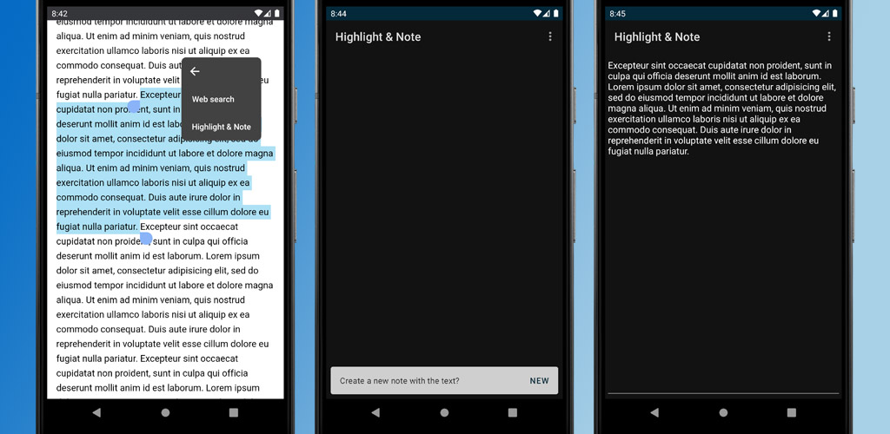

# Highlight-and-Note

<div align="center">
 
</div>


## Table of Contents
* [About The Project](#about-the-project)
* [How to Use](#how-to-use)
* [Download on Google Play Store](#download-on-google-play-store)
* [Tech](#tech)
* [License](#license)
* [Contact](#contact)


## About The Project
This is basically a notepad application. But it makes easier to create notes from texts reside in other applications.
Simply, when a user select a text in somewhere on phone, the application name Highlight & Note appears in the context menu.
If user taps on the application name, the application receives the text via [intent](https://developer.android.com/guide/components/intents-filters) 
and the user can create a new note or add the selected text to a previously saved note.

## How to Use

<div align="center">
 
</div>

## Download on Google Play Store
[Highlight & Note](https://play.google.com/store/apps/details?id=com.mutkuensert.highlightandnote)

## Tech
* [Coroutines](https://developer.android.com/kotlin/coroutines)
* [ViewModel](https://developer.android.com/jetpack/androidx/releases/lifecycle)
* [Navigation Component](https://developer.android.com/guide/navigation/navigation-getting-started)
* [Room](https://developer.android.com/training/data-storage/room)

## License
```xml
Copyright 2022 Mustafa Utku Ensert

Licensed under the Apache License, Version 2.0 (the "License");
you may not use this file except in compliance with the License.
You may obtain a copy of the License at

    http://www.apache.org/licenses/LICENSE-2.0

Unless required by applicable law or agreed to in writing, software
distributed under the License is distributed on an "AS IS" BASIS,
WITHOUT WARRANTIES OR CONDITIONS OF ANY KIND, either express or implied.
See the License for the specific language governing permissions and
limitations under the License.
```


## Contact
[ensertyazilim@gmail.com](#)
